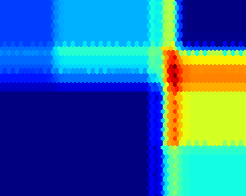
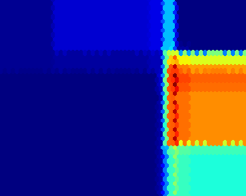

# Relative-likelihood based uncertainty quantification

Relative likelihood-based epistemic and aleatoric uncertainty decomposition for both binary and multi-class classification.

## Example

```
# Load Iris dataset
X, y = load_iris(return_X_y=True)
X = preprocessing.StandardScaler().fit_transform(X)
X=X[:,2:4]

# Plot dataset
plots.plot_dataset(X, y)

# Load Heatmap
X_test = plots.load_Xtest(X)

# Compute margin-uncertainty
aleatoric, epistemic = unc.margin_uncertainties(X, y, X_test)
plots.plot_uncertainties(X_test, aleatoric, epistemic)
```


### Parzen Window

```
aleatoric, epistemic = unc.margin_uncertainties(X, y, X_test, model="ParzenWindow")
plots.plot_uncertainties(X_test, aleatoric, epistemic)
```


### Decision Tree

```
aleatoric, epistemic = unc.margin_uncertainties(X, y, X_test, model="DecisionTree")
plots.plot_uncertainties(X_test, aleatoric, epistemic)
```


### Random Forest

```
aleatoric, epistemic = unc.margin_uncertainties(X, y, X_test, model="RandomForest")
plots.plot_uncertainties(X_test, aleatoric, epistemic)
```



### Nearest Neighbors

```
aleatoric, epistemic = unc.margin_uncertainties(X, y, X_test, model="NearestNeighbors")
plots.plot_uncertainties(X_test, aleatoric, epistemic)
```


## Reference
